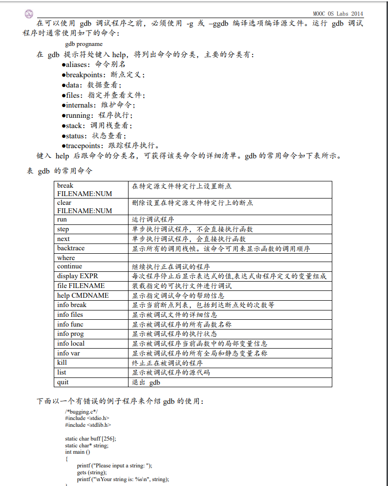
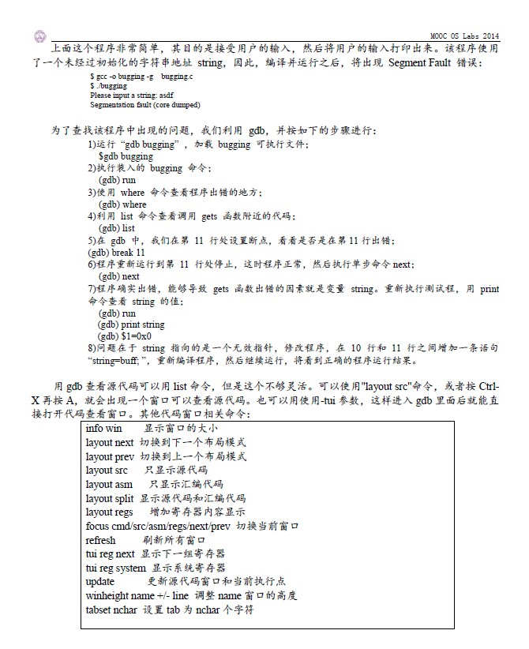

[TOC]
### shell命令
```shell
man printf  查询该函数
pwd 查看当前目录
ls  查看当前目录下的文件
ls  [dir]   查看指定目录下的文件
mkdir [dir]     创建目录
rm -f [dir]  强制删除目录及其文件
cat   [file]    打开文件
less   [file]    打开文件
cp file1.txt file1_copy.txt     复制文件
mv file1.txt new_file.txt       移动文件
touch tempfile.txt              建立一个空文本文件
ps                              查询当前进程
ps -a                            列出系统当前运行的所有进程
cd    [dir]     进入目录
cd  ..         返回上层目录
make    调用gcc编译文件(需要Makefile文件)
make  qemu  调用qemu执行文件
ctrl + c    kill进程
ctrl z      停止进程
make clean  删掉编译产生的文件
*****************
understand &    启动understand
# 要启动一个进程到后台，追加一个 & 命令
meld  [dir1] [dir2]     用meld比较两个目录
```

### 安装软件
```shell
apt -get install <package>
# 下载 <package> 以及所依赖的软件包，同时进行软件包的安装或者 升级 。
apt -get remove <package>
# 移除 <package> 以及所有依赖的软件包。
apt -cache search <pattern>
# 搜索满足 <pattern> 的软件包。
apt -cache show/showpkg <package>
# 显示软件包 <package> 的详细信息
```
### gcc的基本用法
- 安装
`su do apt -get install build essential`
- 编译
`gcc -Wall hello.c -o hell o`

### gdb的使用




## 操作系统

### 启动
加电 => BIOS检测硬件 => 扫描硬盘的第一个扇区并将bootloader加载到内存 => 加载os到内存 => 操作系统运行起来

| 系统调用(system call) | app对os发出请求 | 同步或异步             |
| --------------------- | ---------------| -------------------- |
| 异常(exception)       | app运行出现意外 | 同步                  |
| 中断(interruption)    | 外设发出的请求  | 异步(不确定产生的时间) |

- 地址空间
  - 逻辑地址：app看见的地址，程序员看见的地址
  - 线性地址：os看见的地址
  - 物理地址：cpu看见的地址
  - 编译：把符号地址(&a)转换为逻辑地址
  - cpu执行程序：先寻址=>(代码、数据的)逻辑地址=>查页表(由os建立)=>物理地址=>取出数据并计算